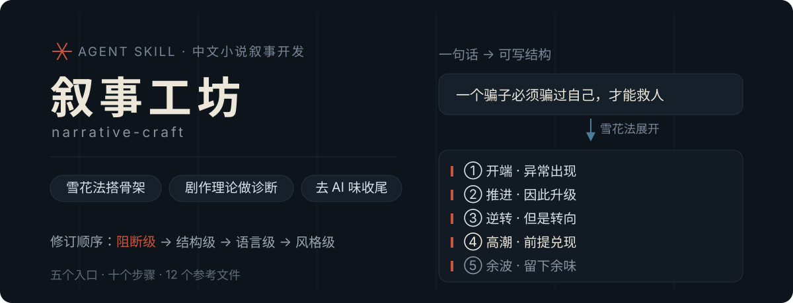
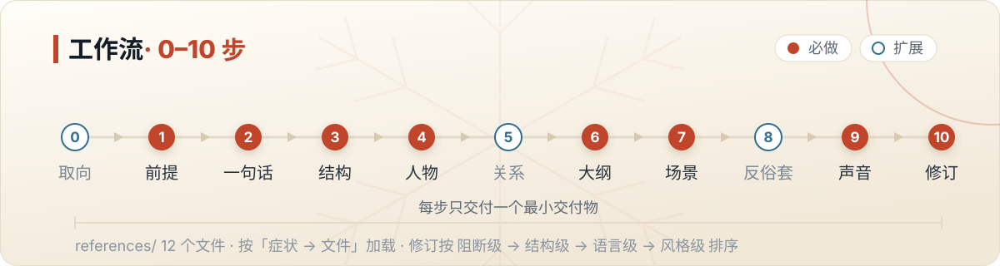

<div align="center">

# narrative-craft · 叙事工坊

**雪花法搭骨架 · 剧作理论做诊断 · 去 AI 味收尾**

中文小说叙事开发的 Agent Skill：从一句话逐层展开成可写的结构，判断结构是否成立、哪里失效，再让文字和故事都更耐读。

触发：写小说 · 故事结构 · 人物弧光 · 场景规划 · 反套路 · 去 AI 味 · 叙事开发

</div>

---



## 从哪个入口进

先看你手里已经有什么。每步只交付一个**最小交付物**——一句话前提、五段大纲、场景表、样章任务，不会一上来问一堆问卷。

| 你现在的状态 | 从哪里进 | 拿到什么 |
|---|---|---|
| 只有一个想法 | 第 0/1 步，从零顺序推进 | 一句可争辩的前提 |
| 有片段或设定 | 从片段反推第 1/3/4 步，再进第 7、9 步 | 结构骨架 + 人物卡 |
| 有现成大纲 | 补强第 4/8/9 步 | 关系张力 + 偏离策略 + 声音五项 |
| 只想要成品 | 极简补齐第 0–3 步的关键判断 | 先给样章，再决定是否扩写 |
| 有完整草稿要修结构 | 直接进第 10 步的结构诊断 | 分级问题清单 |

管单部作品的构思、结构诊断与定稿。长篇连载的项目管理——日更、跨章追踪、分卷细纲、拆文导入——交给 `story-long-write`，两者可接力：本技能定前提/结构/人物/声音，它负责跨章节执行。

## 工作流



| 步骤 | 类型 | 最小交付物 |
|---|---|---|
| `0` 创作取向校准 | 扩展 | 一段方向共识（题材 / 气质 / 要避开的俗套，填 3 项即可） |
| `1` 前提与主题 | 必做 | 一句**可争辩的前提**：人物倾向 + 冲突 + 结局方向 |
| `2` 一句话概括 | 必做 | 25 字内的一句话，给稳妥 / 冒险 / 文学三个版本 |
| `3` 结构骨架与框架选型 | 必做 | 一个结构方案 + 五段推进 + 风险提示 |
| `4` 人物 | 必做 | 每个关键人物一张轻量卡（欲望 / 需求 / 创伤 / 核心矛盾 / 弧线） |
| `5` 关系网与秘密 | 扩展 | 2–3 条关系张力 + 1 个错位认知事件 |
| `6` 一页大纲 | 必做 | 五段大纲，每段至少一个可视化细节 |
| `7` 场景清单 | 必做 | 场景表：视点 / 目标 / 冲突 / 变化 / 意象回环 |
| `8` 反俗套检查 | 扩展 | 3 条偏离策略 + 1 处要删的套话 |
| `9` 叙述声音与样章方案 | 必做 | 声音五项 + 1500–2500 字样章 |
| `10` 修订 | 必做 | 分级问题清单 + 去 AI 味三遍法 |

结构框架是可选诊断工具，不是模板：商业向用八节点 / 节拍表，文学向用 Truby 七步 / McKee 缺口，短篇用效果统一，英雄之旅**仅作诊断**。

修订两遍，**先结构后语言**；发现的问题按下面这个顺序修，不要倒过来先抠字句：

| 级别 | 例子 |
|---|---|
| 阻断级 | 结局任意、故事漫无目的 |
| 结构级 | 中段塌陷、说明倾泻、缺口太窄 |
| 语言级 | AI 味、心理直述、书面腔、升华式收束 |
| 风格级 | 模板化人设、套话台词、陈词滥调 |

## 设计原则

1. **渐进披露**：`SKILL.md` 只放流程与路由，理论沉在 `references/`，按「症状 → 文件」定位，用多少读多少。
2. **一步一交付**：每步一个最小交付物；深度问卷只在用户想深入时才展开。
3. **诊断先于重写**：结构问题用「症状 → 成因 → 修法」定位，改的是失效点，不是整篇。
4. **可降级**：不确定该读哪个文件时，退到 `methodology-overview.md` 的章节目录，再用第 10 步的诊断表定位问题类型。
5. **可评测**：`evals/evals.json` 有 10 个 case，覆盖从零构思、结构修补、人物与语言路径。

## 按需加载

```text
SKILL.md                        主流程与路由
assets/readme/                  README 视觉层（hero.svg / workflow.svg）
evals/evals.json                10 个评测 case
references/
├── methodology-overview.md   剧作理论总纲：前提 / 结构 / 人物 / 场景 / 压缩 / 诊断
├── character-workshop.md     人物卡、关系网、对手与反派层级
├── anti-cliche.md            反俗套、反转工具箱、钩子、情感弧线
├── voice-and-prose.md        叙述声音、文风模块表
├── genre-writing.md          题材 → 推荐框架 → 常见俗套
├── outline-methods.md        大纲方法、升级感、黄金前三章
├── dialogue-mastery.md       对白
├── opening-design.md         开头
├── de-ai-writing.md          去 AI 味三遍法
├── banned-words.md           禁用词 / 禁用模式
├── quality-checklists.md     成稿质检
└── glossary.md               中英术语对照
```

## 安装

```bash
git clone https://github.com/Guivyn/narrative-craft.git ~/.agents/skills/narrative-craft
```

## 来源与维护

雪花法、去 AI 味、反俗套来自 `snowflake-novel-writer`（renky1025/agent-skills）；结构理论来自 `fiction-writing-story-development`（alt-code-ai/agent），已提炼成 `references/methodology-overview.md`。本仓库是本地定制的合并版，与上游没有原文继承关系——迁入映射与已知偏离见 `UPSTREAM.md`。
